# ponderada_primeira_semana
 
## Aprendendo Git (linha de comando) - Tutorial

O Git é uma das ferramentas mais importantes que qualquer desenvolvedor deve conhecer. Ele é um sistema de controle de versão distribuído que permite a múltiplos desenvolvedores trabalhar juntos em um mesmo projeto. O Git ajuda a rastrear e gerenciar mudanças no código, sem o risco de sobreposição ou conflito de alterações.

Este tutorial irá conduzi-lo através dos comandos básicos do Git, permitindo que você configure seu próprio repositório, faça commit de alterações e colabore com outros desenvolvedores.

Neste tutorial também iremos aprender a como criar um repositorio local em nossa maquina e conecta-lo com um repositorio remoto no Github

### Objetivo: Siga os passos abaixo para crianção do seu repositorio local e começar a entender a como trabalhar com o git em seus projeto utilizando o versionamento de código

**1 - Crie uma nova pasta no seu computador utilizando a linha de comando conforme abaixo**

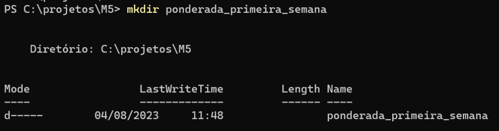

**2 - Adicione um arquivo README.md em sua pasta utilizando a linha de comando conforme abaixo**

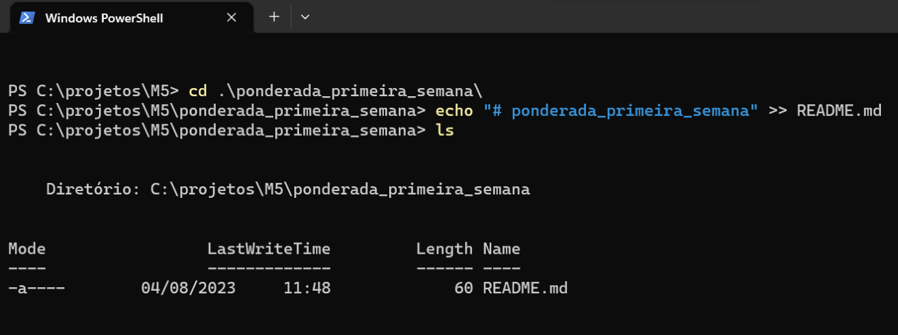

Obs: Utilize o comando ls para verificar se esse arquivo foi criado da forma correta

**3 - Após a criação da pasta e do arquivo README.md utilize o comando git init para criar o repositorio local**

Obs: Utilize o comando git status para verificar que o arquivo README.md ainda não está preparado para ser commitado como mostra na figura a cima

**4 - Utilize o comando git add conforme imagem abaixo para preparar o arquivo para receber o commit e verifique se tudo deu certo com o comando git status**

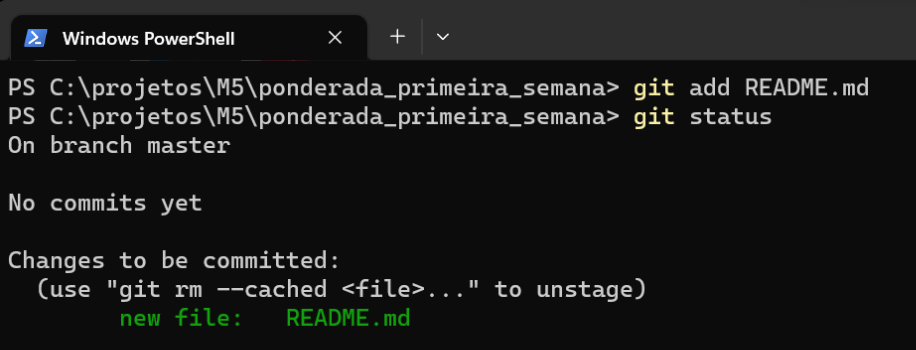

**5 - Para realizar o commit utilize o comando git commit -m "descrição_do_commit"**

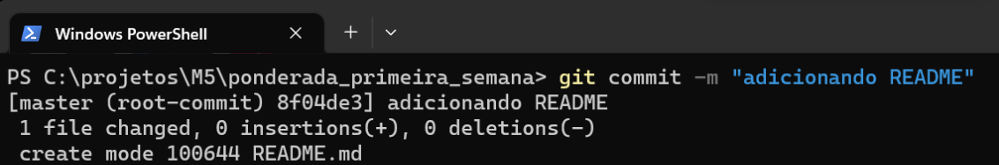

Obs: E sempre importante descrevermos para que todos possam entender o que foi modificado

**6 - Após realizar alguma mudança no github utilize o comando git fetch para verificar o que foi alterado no seu repositorio remoto**

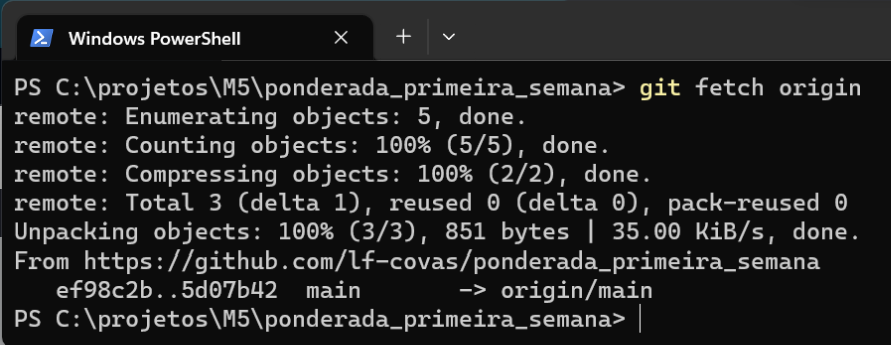

**7 - Para verificar o status dessa mundaça utilize novamente o git status**

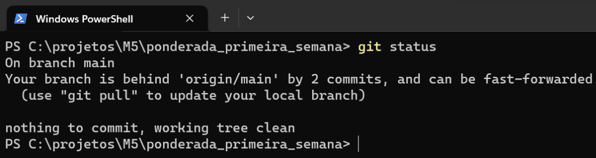

**8 - Para verificar todas as mudanças que foram feitas necesse repositorio utilize o comando git log oring/main**

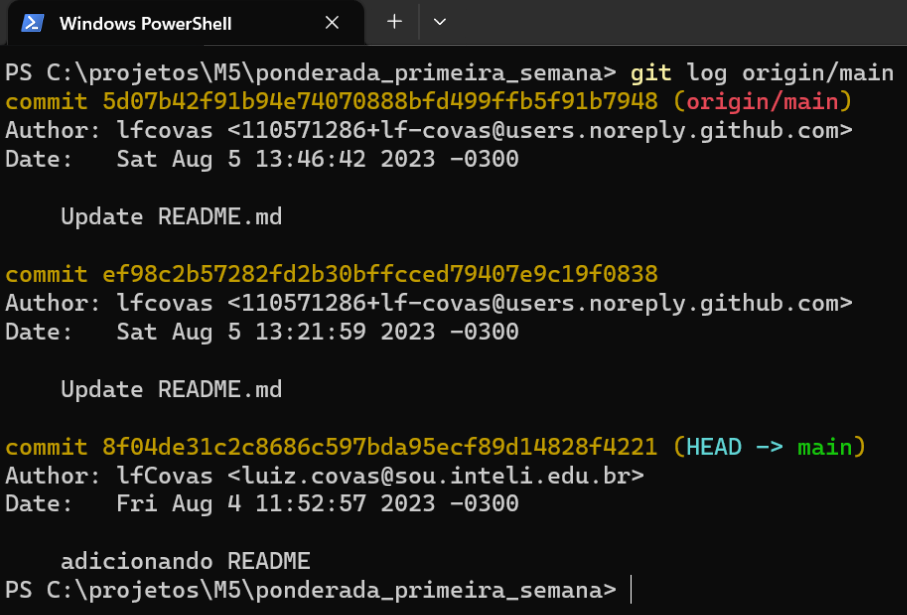

**9 - Para verificar a mudança entre o nosso repositorio local e nosso repositorio remoto utilize o comando git diff origin/main como mostra a imagem a baixo:**

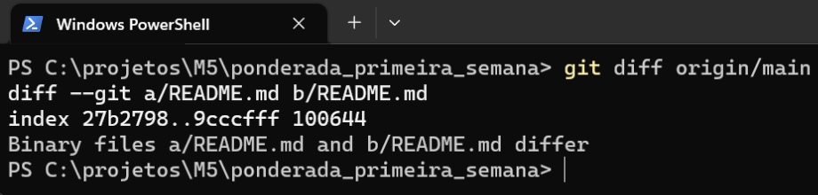

**10 - Após verificar as mudanças feitas podemos utilizar o comando merge para unifica-las e deixando nosso repositorio local atualizado conforme o nosso remoto**

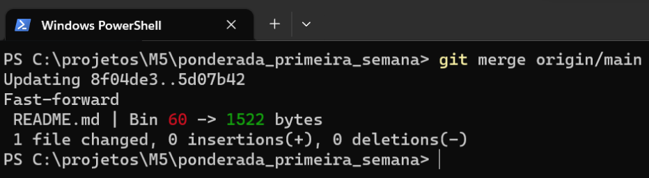

**11 - Utilizamos novamente o comando git status para verificar se tudo ocorreu da forma correta e nosso repositorio está atualizado**

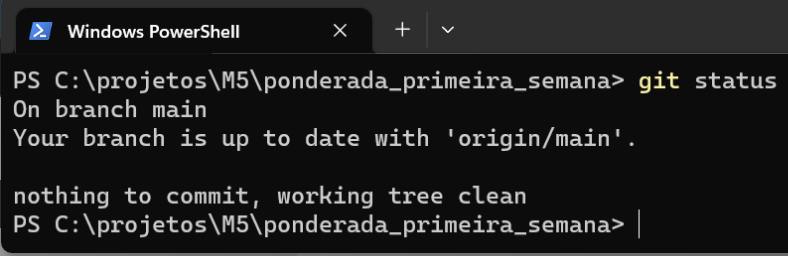

**12 - Para atualizar nosso repositorio local de uma forma mais facil e simples, também podemos utilizar o git pull**

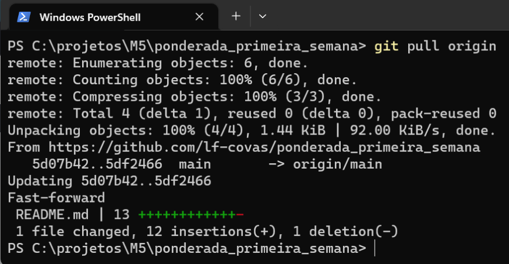

É assim que você mantém seu Git local atualizado a partir de um repositório remoto ;)

**13 - Agora faça uma alteração no seu README.md local e utilize o comando git commit -m "titulo_do_que_foi_modificado" para preparar as mudanças para subir ao github remoto**

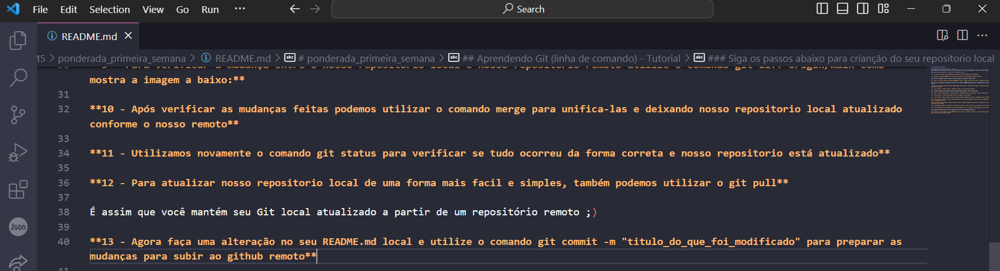
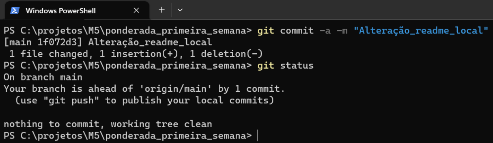

Obs: Utilize o comando git status para verificar se tudo ocorreu da maneira correta

**14 - Agora iremos utilizar o comando git push para subir todas as mudanças feitas em nosso repositorio local para o nosso repositorio remoto no github**

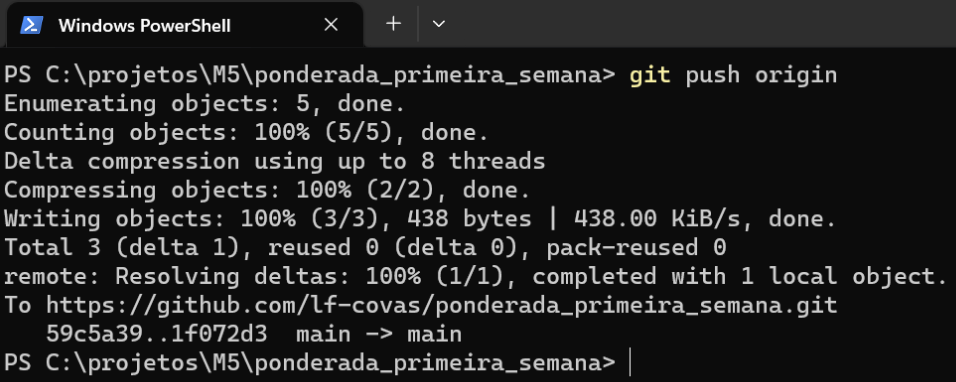

## Objetivo: Agora iremos aprender a como trabalhar com ramificações dentro do nosso projeto no github

No GitHub, acesse seu repositório e clique no botão branch e depois criar nova branch.

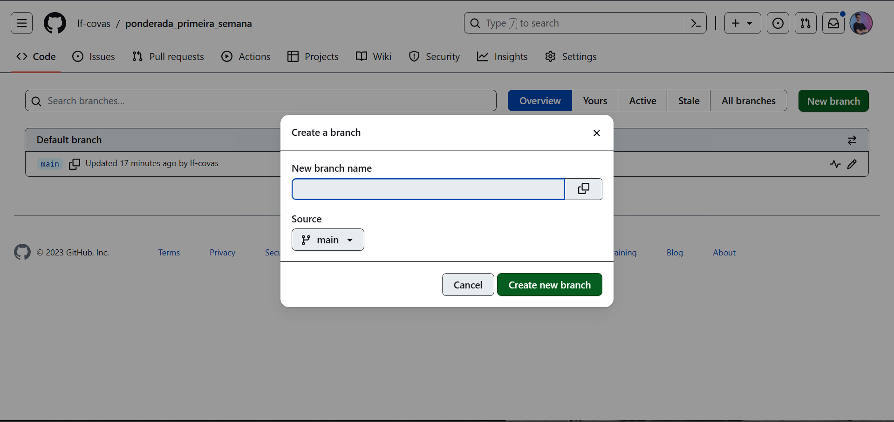

Agora estamos trabalhando em uma ramificação do projeto principal (main) e podemos editar o arquivo readme.md que foi copiado e lá.

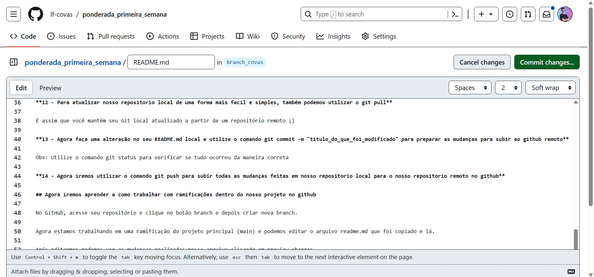

Após editarmos podemos ver as mudanças realizadas nesse arquivo clicando em preview.

Se você estiver satisfeito com a mudança, adicione um comentário que explique o que você fez, e clique em Confirmar alterações.

**1 - Agora entramos no nosso repositorio local novamente e utilizamos o comando git pull para atualizar o nosso codigo**

Obs: Utilize o comando git status para verificar se tudo ocorreu como esperado para seguirmos para os proximos passos.

**2 - Agora utilize o comando git branch para vermos em qual branch estamos trabalhando em seguida utilize o comando git branch -a para vermos todas as branch que temos em nossos repositorios (tanto local quanto remoto) e em qual branch estamos**

Obs: O asterisco (*) representa a branch atual e podemos utilizar branch -r apenas para branch remotas

**3 - Utilize o comando git checkout *nome da branch* para termos acesso a branch remota e em seguida utilize git pull para deixar tudo atualizado caso não esteja**

## Objetivo: Agora iremos aprender a como enviar uma nova branch criada em nosso repositorio local para o nosso repositorio remoto

**1 - Utilie o comando git checkout -b *nome da nova branch* para criar uma nova branch em nosso repositorio local**

Obs: Altere o readme.md para verificarmos as mudanças utilizando o comando git status em nossa nova branch

**2 - Como o arquivo foi modificado, iremos utilizar o comando git add README.md para adiciona-lo a linha de preparo e em seguida verificar o seu status**

**3 - Agora iremos preparar as mudanças feitar para envia-las para nosso repositorio remoto utilizando novamente o comando git commit e enviando para o repositorio remoto utilizando o comando git push conforme imagem abaixo:**

Vá para o GitHub e confirme se o repositório tem uma nova branch

**4 - Utilize a opção compare & pull request para verificar se está de acordo com as mudanças e junta-las**

Se as alterações parecerem boas, você pode ir em frente, criando um pull request
Uma solicitação pull é como você propõe alterações. Você pode pedir a alguns que revisem a sua contribuição e mescla-a em seu ramo principal.

Como este é o seu próprio repositório, você mesmo pode solicitar o pull merge

# Conclusão

Com isso podemos perceber que o uso de branches e Git em projetos de software oferece várias vantagens, incluindo o isolamento de alterações para experimentação segura e desenvolvimento independente de recursos, facilitando a colaboração entre equipes ao permitir a fusão eficaz de mudanças separadas. O Git, como sistema de controle de versão, mantém um histórico detalhado de alterações, permitindo a reversão fácil para estados anteriores de código e a identificação de origens de bugs. Além disso, permite um gerenciamento eficaz de lançamentos de recursos e promove a revisão de código para melhorar a qualidade do software.
