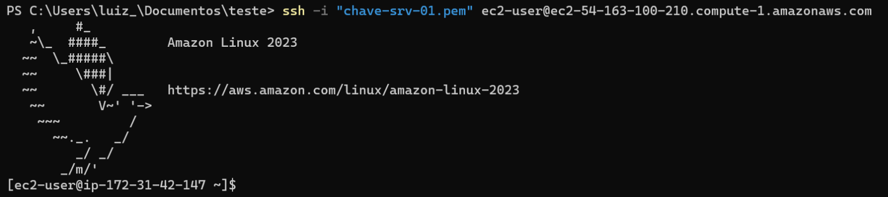

# ponderada_terceira_semana

## Criando uma instância de máquina EC2 na AWS e acessando a com SSH - (Tutorial)

### Introdução
Neste tutorial iremos aprender o passo a passo para criar uma estancia de maquina EC2 na AWS e acessa-la utilizando a SSH. Algo extremamente importante pois o Amazon EC2 é amplamente utilizado por empresas e desenvolvedores para hospedar aplicativos, sites, serviços e cargas de trabalho diversas na nuvem, fornecendo flexibilidade e escalabilidade para atender às necessidades de computação e otimizando custos qunado bem aplicado.

### Objetivo: 
Siga os passos abaixo para a criação de uma instancia no serviço EC2 da AWS e aprender a como começar a utilizar o serviço de maquinas virtuais da Amazon, comunicando via SSH

Configurando sua Primeira Instância na AWS EC2

A seguir, você encontrará um guia passo a passo para criar sua primeira instância na AWS EC2:

**Passo 1 - Acesso ao Painel EC2:**
Ao acessar a tela inicial do "Painel EC2" em seu laboratório de aprendizagem, clique na opção "Instâncias" na barra lateral, como indicado na imagem abaixo:

**Passo 2 - Iniciando uma Instância:**
Em seguida, clique no botão "Executar instâncias" para criar sua primeira instância, conforme mostrado na imagem abaixo:

**Passo 3 - Configuração da Instância:**
Ao clicar no botão, você será solicitado a fornecer algumas informações para criar a instância. Comece digitando um nome para a instância, por exemplo, "srv-01", como mostrado na imagem abaixo:

**Passo 4 - Escolha da Imagem do Sistema Operacional:**
Na sequência, escolha a imagem de sistema operacional desejada para a instância. No exemplo, selecionamos a opção "Amazon Linux 2023 AMI" com arquitetura de 64 bits (x86), como ilustrado abaixo:

**Passo 5 - Escolha do Tipo de Instância:**
Nesta etapa, selecione o tipo de instância que melhor se adequa às necessidades do seu projeto. Avalie fatores como CPU, memória e armazenamento. No exemplo, optamos pela instância "t1.micro", conforme demonstrado abaixo:

Observação: Lembre-se de que instâncias mais robustas podem aumentar os custos.

**Passo 6 - Criação do Par de Chaves:**
Crie um par de chaves para autenticar o acesso à instância. Clique em "Criar novo par de chaves" e forneça um nome para o par de chaves. Recomenda-se um nome relacionado à instância, como no exemplo a seguir:

Observação: A segurança do par de chaves é essencial para proteger suas instâncias e dados na AWS.

**Passo 7 - Download do Par de Chaves:**

Após nomear o par de chaves, clique em "Criar par de chaves" para baixar o arquivo que funcionará como a "senha" para acessar a instância. Um exemplo é apresentado na imagem abaixo:

**Passo 8 - Configuração de Rede e Segurança:**

Defina as regras de tráfego de rede. Configure um grupo de segurança com regras de firewall para permitir tráfego por HTTP, HTTPS e SSH de qualquer lugar, contanto que possua o par de chaves, como ilustrado abaixo:

Observações: No nosso caso, selecionamos o trafego por HTTP, HTTPS e SSH de qualquer lugar desde que possua o nosso par de chave para acessa-la

**Passo 9 - Seleção do Armazenamento:**
Escolha a quantidade de armazenamento desejada para a instância em gigabytes, como mostrado na imagem abaixo:

**Passo 10 - Revisão e Criação:**
Verifique as configurações no resumo à direita e, se estiverem corretas, clique em "Executar instância" para criar sua primeira instância, conforme a imagem abaixo:

**Passo 11 - Confirmação da Criação da Instância:**

Se todos os passos foram seguidos corretamente até este ponto, você verá uma tela de confirmação indicando que a execução da instância foi concluída com êxito, conforme mostrado na imagem abaixo:

Observação: Clique no link para sermos direcionado para a tela de instâncias

**Passo 12 - Conectando-se à Instância:**
Após clicar no link, você será redirecionado para uma tela onde poderá visualizar a instância que acabou de criar, como demonstrado na imagem abaixo. Agora, para estabelecer uma conexão SSH com esta instância, siga os seguintes passos:

Selecione a instância que você deseja se conectar clicando na caixa de seleção ao lado dela.

No canto superior, clique no botão "Conectar".

Observação: Certifique-se de ter seu par de chaves (chave privada) disponível, pois você precisará dela para se autenticar na instância via SSH.

**Passo 13 - Instruções para Conexão SSH:**
Após clicar no botão "Conectar", você será direcionado para um guia passo a passo que o ajudará a estabelecer uma conexão SSH com a máquina recém-criada. Siga as instruções abaixo:

*Abra o promp de comando na pasta em que o arquivo das chaves foi arquivado e coloque o link mostrado com exeplo na imagem anterior*

